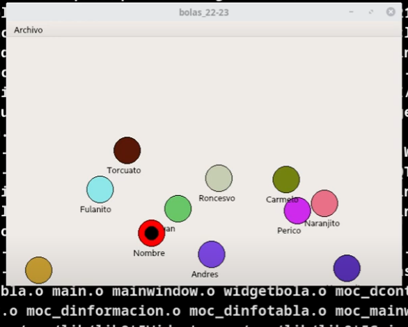

# 🎮 QT Balls Game

Dodgeball game developed with Qt and C++.
A simple yet challenging game where the player must dodge moving balls for as long as possible. Screens were built using Qt Designer, and the game features collision logic, smooth motion, and survival time tracking.



---

## 📱 Main Features

- 🎯 Avoid getting hit by moving balls
- 🎮 Interactive gameplay designed with QT Designer dialogs
- 💻 Developed using C++ with .cpp and .h files for modular code structure
- 🚀 Smooth animations and responsive controls

---

## 🛠️ Technologies Used

- **Language:** C++
- **Framework:** QT (Qt Designer for UI)
- **Development:** Modular .cpp and .h files
- **Platform:** Desktop application

---

## 🧠 Learning Outcomes and Goals

This game was developed as a final project to deepen my understanding of QT framework and C++ programming. It helped me improve UI design skills using Qt Designer and practice event-driven programming with responsive game mechanics.

---

## 👨‍💻 Author

**Michael Llorens Barberá**  
Full-stack Developer | JS, Kotlin, Java, Python, PHP, C++, Hibernate, Spring Boot, SQL, and APIs.  
📧 [LinkedIn](https://www.linkedin.com/in/michael-llorens-barbera-32b9272b3/)  
🌐 [Portfolio](https://github.com/Michael-Llorens)

---

## 📦 Installation

Clone this repository and open it with Qt Creator:

```bash
git clone https://github.com/Michael-Llorens/QT-balls-game.git
